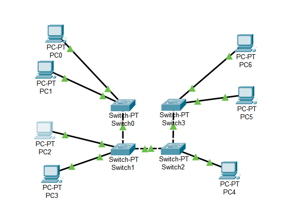
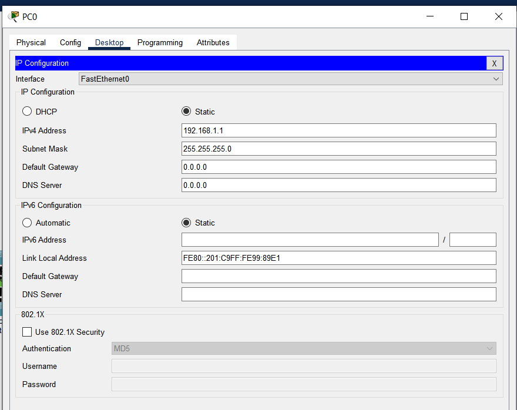
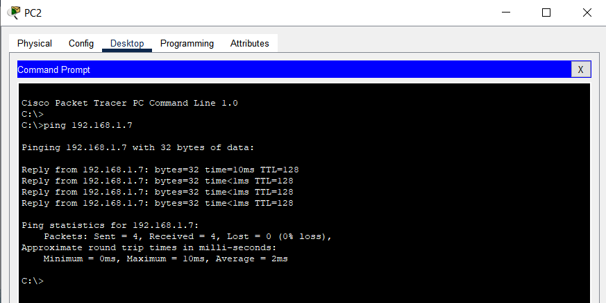
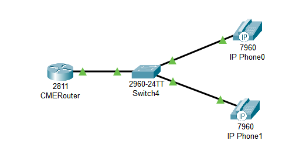
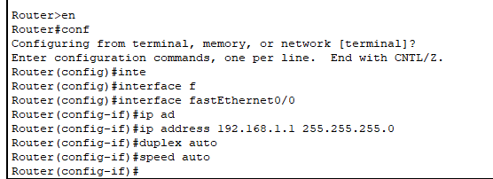
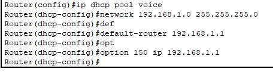
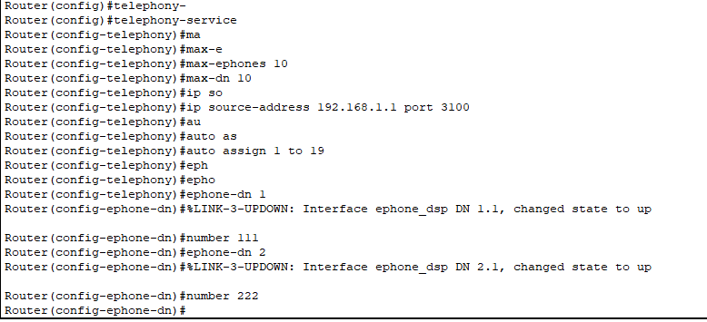
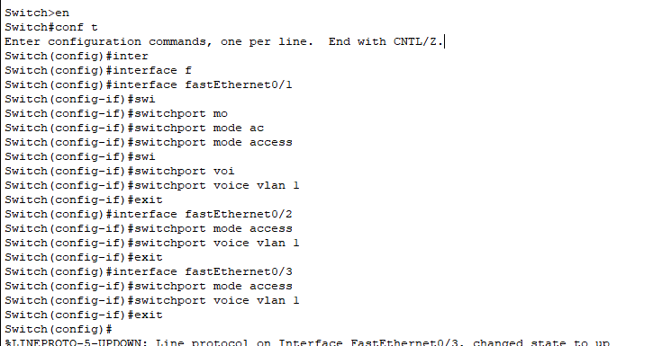
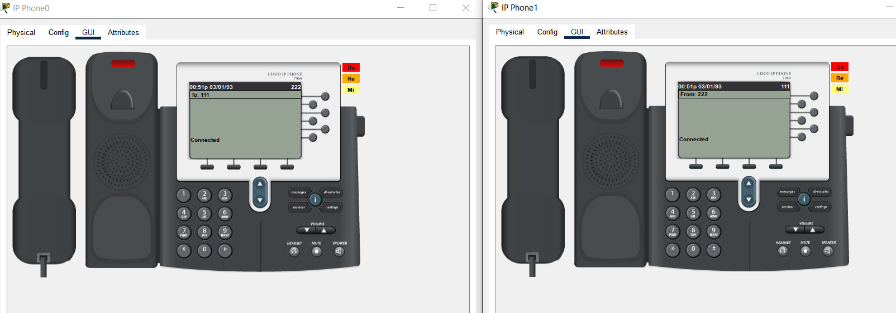
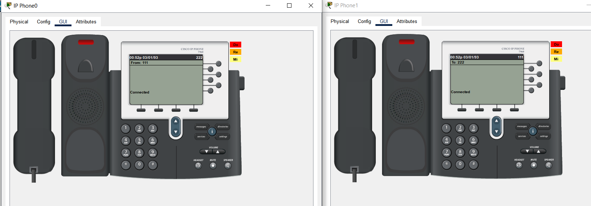

University: [ITMO University](https://itmo.ru/ru/)

Faculty: [FICT](https://fict.itmo.ru)

Course: [IP-telephony](https://github.com/itmo-ict-faculty/ip-telephony)

Year: 2023/2024 

Group: K34202

Author: Guliaeva Alisa

Lab: Lab1 

Date of create: 15.02.2024 

Date of finished: 21.02.2024

<h1>Отчет по лабораторной №1</h1>
<h2>"Базовая настройка ip-телефонов в среде Сisco packet tracer."</h2>

<h3>Цель:</h3>

 Изучить рабочую среду Cisco Packet Tracer, ознакомить- ся с интерфейсами основных устройств, типами кабелей, научиться собирать топологию. Изучить построение сети IP-телефонии с помощью маршрутизатора, коммутатора и IP телефонов Cisco 7960 в среде Packet tracer.

<h3>Ход работы:</h3>

<h4>Часть 1</h4>

Собрали схему соединения

Назначили компьютерам статические IP-адреса: 192.168.1.1/24 - 192.168.1.7/24

Проверили связность

<h4>Часть 2</h4>

Собрали схему соединения

Настроили интерфейс fa0/0 на маршрутизаторе

Настроили DHCP сервера для передачи голоса и данных на маршрутизаторе

Настроили услуги телефонии и IP-телефоны, присвоили им номера

Настроили vlan на коммутаторе

Проверили телефонные звонки

<h3>Вывод:</h3>

В ходе выполнения лабораторной работы мы изучили рабочую среду Cisco Packet Tracer, ознакомились с интерфейсами основных устройств, типами кабелей, научились собирать топологию. Изучили построение сети IP-телефонии с помощью маршрутизатора, коммутатора и IP телефонов Cisco 7960 в среде Packet tracer.

