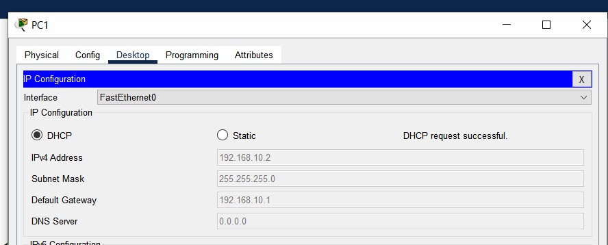

University: [ITMO University](https://itmo.ru/ru/)

Faculty: [FICT](https://fict.itmo.ru)

Course: [IP-telephony](https://github.com/itmo-ict-faculty/ip-telephony)

Year: 2023/2024 

Group: K34202

Author: Guliaeva Alisa

Lab: Lab2 

Date of create: 20.02.2024 

Date of finished: 26.02.2024

<h1>Отчет по лабораторной №2</h1>
<h2>"Конфигурация voip в среде Сisco packet tracer."</h2>

<h3>Цель:</h3>

 Иизучить построение сети IP-телефонии с помощью маршрутизатора Cisco 2811, коммутатора Cisco catalyst 3560 и IP телефонов Cisco 7960.

<h3>Ход работы:</h3>

<h4>Часть 1</h4>

Собрали схему соединения

Изменили имя маршрутизатора.
На маршрутизаторе отключили синтаксис ввода слов DNS сервером, задали пароли для защиты маршрутизатора как в удаленном режиме, так и в режиме консоли

Проверили связность

Настроили интерфейс fa0/0 на маршрутизаторе

На маршрутизаторе настроили интерфейс fa0/0. Настроили DHCP сервера для передачи голоса и данных на маршрутизаторе

Настроили услуги телефонии и IP-телефоны, присвоили им номера

Настроили vlan на коммутаторе

Проверили телефонные звонки

<h4>Часть 2</h4>

Собрали схему соединения

Настроили DHCP сервера для передачи голоса и данных на маршрутизаторе

Для каждого влана был создан свой сабинтерфейс, а на нем настроен свой адрес из сети адресов вланов

На коммутаторе было создано два vlan: 10 - для компьютеров, между которыми передаются данные, и 20 - для ip-телефонов

IP адреса были выданы телефонам

Проверили связность

Проверили телефонные звонки

<h3>Вывод:</h3>

В ходе выполнения лабораторной работы мы изучили построение сети IP-телефонии с помощью маршрутизатора Cisco 2811, коммутатора Cisco catalyst 3560 и IP телефонов Cisco 7960.

