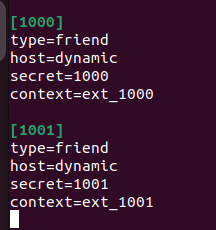

University: [ITMO University](https://itmo.ru/ru/)

Faculty: [FICT](https://fict.itmo.ru)

Course: [IP-telephony](https://github.com/itmo-ict-faculty/ip-telephony)

Year: 2023/2024 

Group: K34202

Author: Guliaeva Alisa

Lab: Lab2 

Date of create: 01.03.2024 

Date of finished: 12.03.2024

<h1>Отчет по лабораторной №3</h1>
<h2>"Использование Asterisk в качестве SIP proxy."</h2>

<h3>Цель:</h3>

 Изучить программный комплекс Asterisk. Настройка Asterisk для локальных звонков.

<h3>Ход работы:</h3>

<h4>Часть 1</h4>

На виртуальной машине с ОС Ubuntu была выполнена установка Asterisk

В файл sip.conf была добавлена информация о телефонах

В файл extensions.conf была добавлена информация о типе канала

После настройки служба Asterisk была перезагружена и проверена

Подключились к CLI Asterisk, проверили созданные sip peers

В качестве soft-телефона устанавливили Zoiper5 с официального сайта, при входе были введены данные телефона 1000, localhost

Проверка подключения

Для проверки был выполнен тестовый звонок

<h3>Вывод:</h3>

В результате выполнения работы был изучен и настроен программный комплекс Asterisk.

